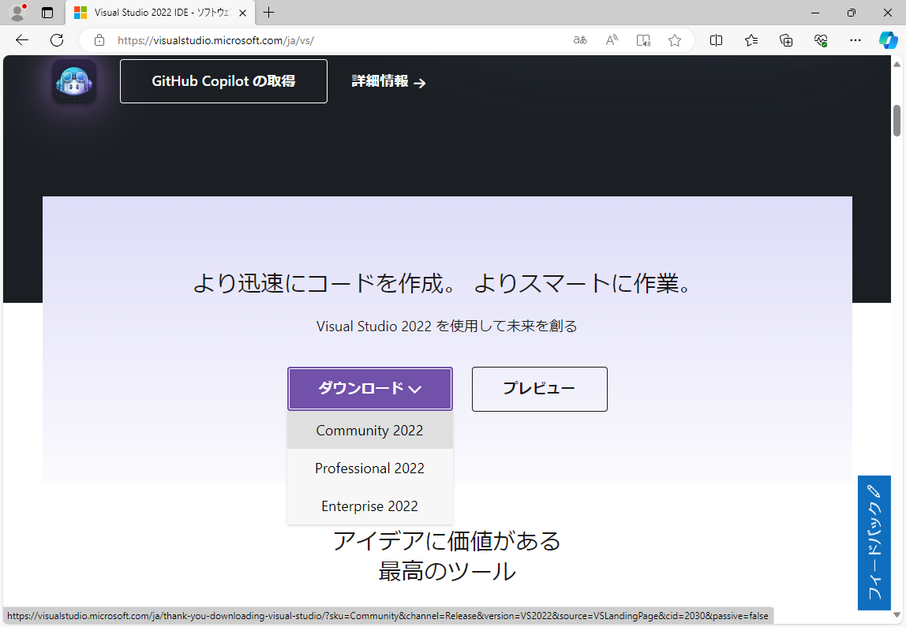
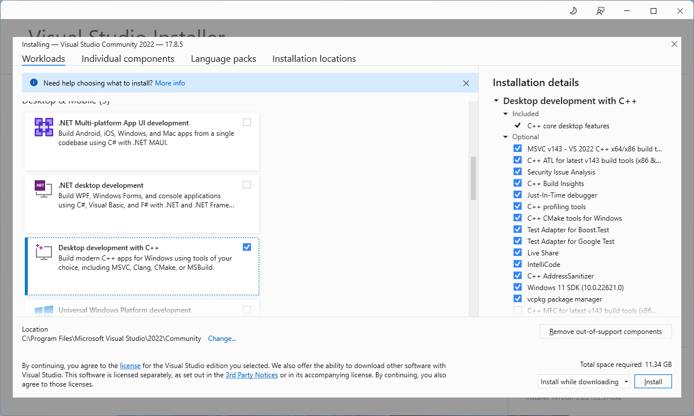
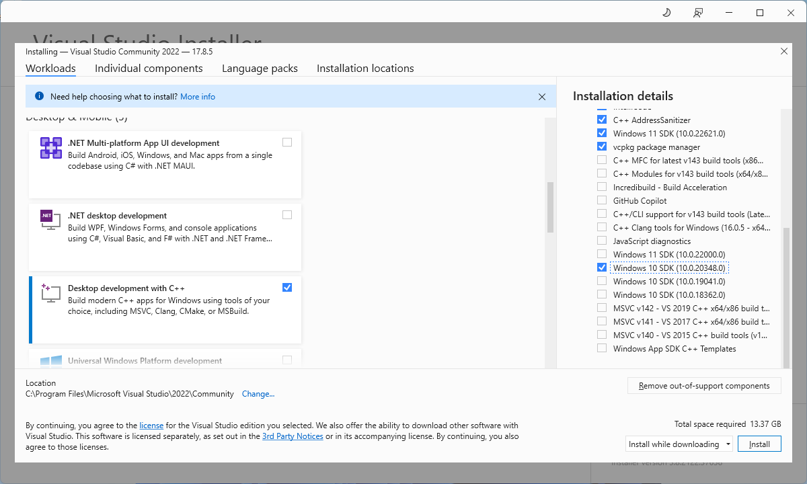
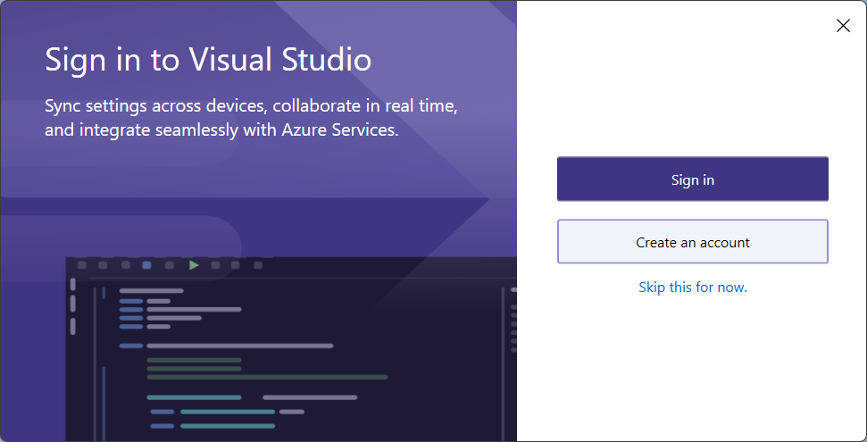
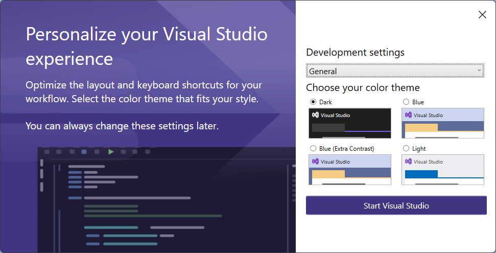
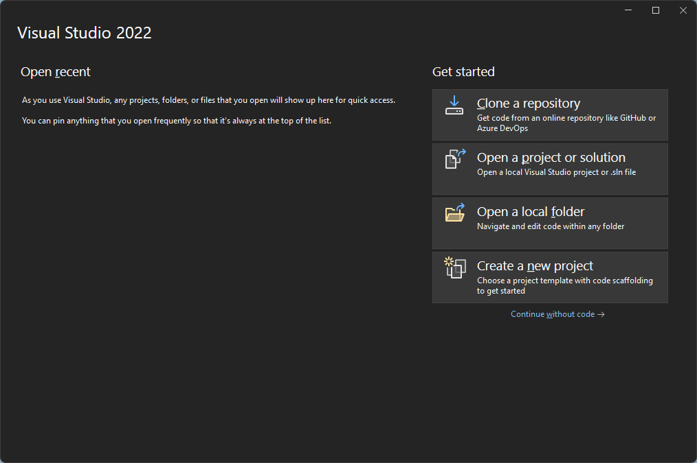
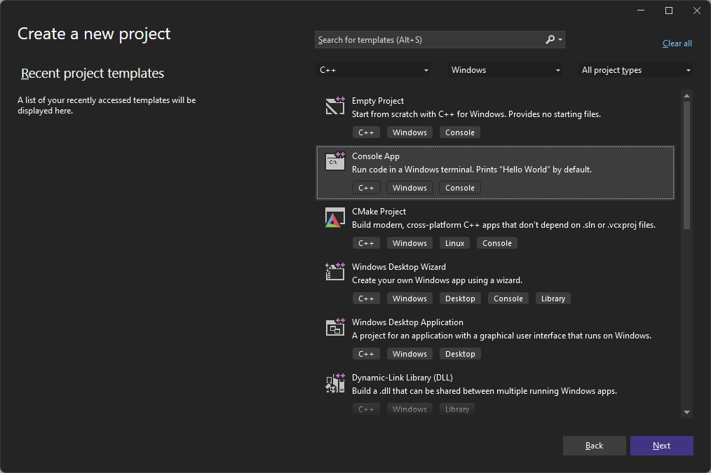
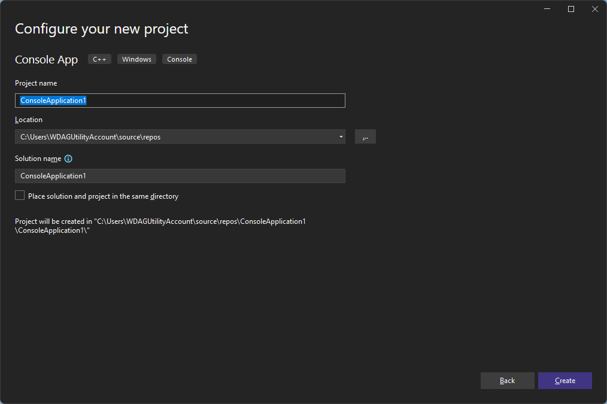
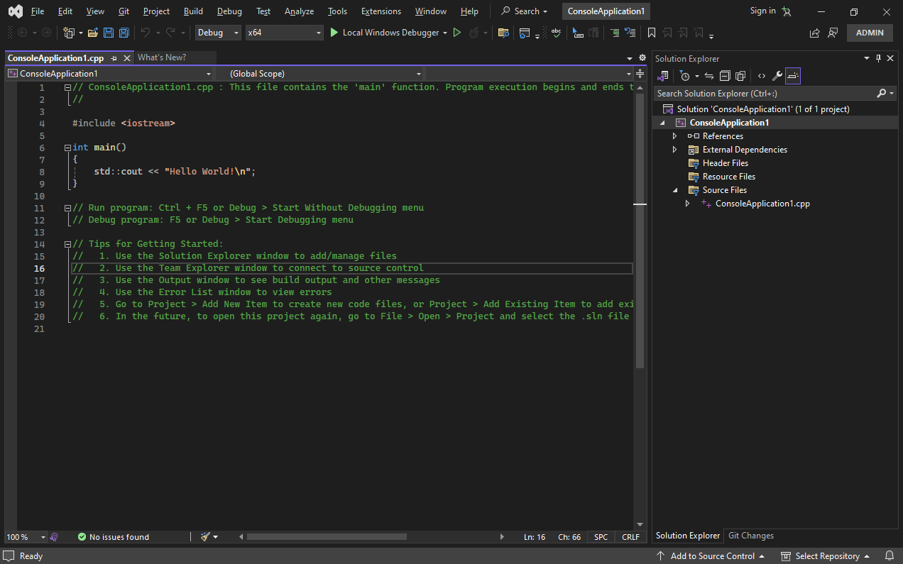
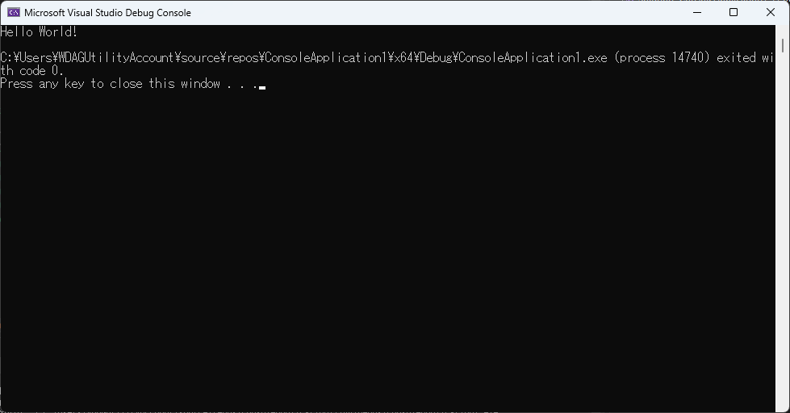

# C言語入門

C言語への入門です。正直なところ[速習C言語入門 : 脳に定着する新メソッドで必ず身につく](https://ndlsearch.ndl.go.jp/books/R100000002-I000008142772)が個人的には良書だと思うのでこれを買って学習を進めるのがいいと思います。なお、ここではこの本はおおむね無視して解説します。  
なお、Windows 11を使用していることを前提としますがWindows 10でも同じように動きます。ただし、macOSを使用しているなどWindowsがインストールされていないPC等は2万円くらいの中古パソコンを専門店で購入してください。

## プログラミングの世界へようこそ

プログラミングの世界へようこそ！  
この章ではコンピュータの誕生からC言語誕生までをざっくりと解説します。

### 機械式計算機の発明

世間一般的には"コンピューター"と最後に"ー"が入りますが、少なくともIT業界では最後の"ー"は書かないと暗黙の了解があるので、"コンピュータ"と書きます。  
コンピュータ（英：Computer）の語源は計算する人（計算手）を意味し、この人たちは算盤や計算尺、紙とペンを使って対数表や三角関数表と格闘しながら計算を行っていました。でも、これでは間違いが起きたり、計算に多大な労力・時間がかかってしまいとても不便です。  
そこで足し算、引き算、掛け算や割り算を歯車を使って計算しようとする試みが17世紀のヨーロッパで生まれ、1837年のイギリスでは数学者のチャールズ・バベッジ氏が（バベッジ機関とも呼ぶ）解析機関を思いつき、1871年に亡くなるまで開発を進めていました。結局のところ完成はしませんでしたが、これが人類初のコンピュータといってもいいでしょう。  
チャールズ・バベッジ氏が開発を進めていた解析機関ですが、なんと当時からプログラムに沿って計算を行うという着想を得て、プログラミングも行われいました。解析機関のプログラムに関わりのあった、ラブレース伯爵夫人オーガスタ・エイダ・キング女史（以下、エイダ・ラブレス氏）がこのプログラムの可能性を論じており、今では当たり前のようなコンピュータがただの計算機ではなく芸術を生み出すツールにもなるという発想を残していました。なお、エイダ・ラブレス氏は（否定する説もありますが）世界初のプログラマと呼ばれることもあります。

### 電気計算機の実用化

米国では10年に1度、国勢調査を行っていましたが1880年の国勢調査では手作業の集計に9年もかかっていました。人口の増え続けるこの当時、このままでは次の調査までに集計が終わらなくなるのは火を見るよりも明らかです。  
そこで、時は1889年、MIT（マサチューセッツ工科大学）の機械工学科に在席していたハーマン・ホレリス氏によって、タビュレーティングマシンが発明されました。このマシンはパンチカードを用いて電気的に集計を行う画期的な発明で、この発明で彼はタビュレーティングマシン社を創業しました（この会社は紆余曲折あり、現在ではInternational Business Machines Corporation、通称IBM社となります）。

### 電子計算機の実用化

* ENIACの開発  
時は大戦真っ只中、1943年に米国ペンシルバニア大学の工学科にてENIACが作成されました。これは真空管同士を配線してプログラムを作成し計算するという代物で、砲弾の飛行をシミュレーションやマンハッタン計画（原爆の開発）のために使用されました（電子計算機の大規模な使用は戦争への利用が初めてです）。  
なお、これよりも前にアイオワ州立大学にてアタナソフ&ベリー・コンピュータが生まれたり、イギリスではColossusというドイツのエニグマ暗号を解読するためのコンピュータが開発されましたが歴史に埋もれてます…

* EDVACの開発  
ENIACの開発メンバーは次に、真空管の配線ではなく記憶装置（メモリ）にプログラムを内蔵して計算するEDVACというコンピュータが開発されました。このコンピュータの仕組みが現在のパソコンやスマートフォンの基本原理となるノイマン型の誕生です。

### アセンブリ言語の誕生

[電子計算機の発明](#電子計算機の発明)で触れたEDVACにてプログラムを内蔵するコンピュータが生まれ、このコンピュータが理解できる言語を機械語と呼ばれます。ただ、人間には0と1の羅列なんて（訓練すればできるかもしれないが）理解不能です。  
そこでEDVACの後継とされる、EDSACではテープに印字された1文字を命令として10進数を自動的に0と1の2進数に変換（翻訳）する機能が追加されました。翻訳される前をアセンブリ言語といい、翻訳する機能をアセンブラと呼びますが、これによってプログラムの作成はより簡単になりました。  
ちなみに月に人類を送ったアポロ計画でもコンピュータが使われていましたが、このロケットのコンピュータプログラムはアセンブラ言語で書かれています。[chrislgarry/Apollo-11: Original Apollo 11 Guidance Computer (AGC) source code for the command and lunar modules.](https://github.com/chrislgarry/Apollo-11)

### COBOLの誕生

先に生まれたアセンブラ言語では、コンピュータによって全く違う文法であったり、コンピュータ毎に決まった書き方があります。これではそれぞれのコンピュータに精通した技術者でなければプログラムは書けません。  
時は1959年、EDSAC以降いろんなコンピュータ開発され、アセンブラ言語の難しさを解消した事務処理言語が乱立しましたが、使う側にしてみれはたまったものではありません。そこで、アメリカ海軍の軍人であるグレース・ホッパー准将（最終階級）らによりCOBOL（共通事務処理言語）が生み出され、今でも銀行や電力会社などで使われているメインフレームというコンピュータのプログラミング言語として現役です。

### FORTRANの誕生

COBOLが生まれる少し前の1957年、IBM社のコンピュータでは事務処理言語が主に使われていましたが、その名の通り事務処理に特化しているので、科学技術計算にはとても使いにくいものでした。そこでIBM社によってFORTRANと言われるプログラミング言語が誕生しました。  
この言語もスーパーコンピューター等や、科学技術計算を行うプログラムでは現役のプログラミング言語で、のちにC言語へ大きな影響を与えることとなりました。

### C言語の誕生

時は1960年、AT&Tベル研究所でMulticsというOS（Operating Systemの略で基本ソフトと呼ばれる、現在ではLinux、Android、iOS、macOSやWindows等に相当する様なプログラム）が開発されますが、残念なことにベル研究所はこのOSの開発から手を引いてしまいます。  
実はこのOSではスペース・トラベルというゲームが遊べるというおまけがあり、これを開発・熱中していたケン・トンプソン氏はMulticsから手を引いた後も遊びたくて仕方ありませんでした。ある日、余っていたコンピュータであるPDP-7を発見し、これでスペース・トラベルを動かせないかと、デニス・リッチー氏らを巻き込んでアセンブラの開発から始めて、UNIXと名づけられたOSを開発することになります（このOSがmacOSからのiOSや、LinuxからのAndroidへ発展するのは別のお話）。  
しかし、アセンブリ言語はコンピュータによって書き方が全然違うので、他のコンピュータへ移植するのは大変です。そこで、コンピュータの違いを隠したプログラミング言語でUNIXを書くためにC言語が生まれました。  
戦争でコンピュータが発展し、ビジネスや科学技術分野で使われ始め進化するのは真っ当な道筋に見えますが、ゲームをやるためにOSの開発やプログラミング言語を作ってしまうなんて驚きですね。しかもこのC言語は、この入門で触れるくらい広く使われいて、見聞きするコンピュータのプログラムは大体C言語とその発展形で書かれています。

## 環境構築

学習を進めるうえで必要なソフトウエアを紹介します。元ネタの本（というよりC言語入門の書籍全般）ではBorland C++ CompilerとTeraPadが人気だと思います。しかしながら、執筆者の独断と偏見で下記のソフトをインストールすることをお勧めします。

* [サクラエディタ](https://sakura-editor.github.io/)  
執筆者の経験上、これが業務利用で一番多く使われていて、使いやすいテキストエディタです。インストールしておくと便利な場面があるかもしれないので入れておきましょう。
* [Visual Studio - Community Edition](https://visualstudio.microsoft.com/ja/vs/)  
Visual Studioは実際にプログラムを開発する上で欠かせないものが、ほぼすべてそろいます。商用使用には若干厳しい制限がありますが、学習するうえでは問題ないでしょう。

### サクラエディタのインストール

[ここから](https://github.com/sakura-editor/sakura/releases)からダウンロードして、インストーラを取得してください。  
～Win32-Release-Installer.zipというファイルをダウンロード後、解凍するとインストーラが出てくるはずなのでインストールすること。（手順は超簡単なので解説しません）

### Visual Studio Community Editionのインストール

Webページは予告なく変更されることがあるので臨機応変にお願いします。なおVisual Studioのインストーラは画像では英語となっていますが、日本語に設定しているWindowsでは日本語表示になるはずです。

1. [ここ](https://visualstudio.microsoft.com/ja/vs/) を開き、ダウンロードからCommunityを選択します

1. ダウンロードしたファイルを実行するとウインドウが開くので`Continue`（続ける）をクリック
1. `Desktop development with C++`を選択する。

1. `Windows 10 SDK(10.0.20348.0)`を選択（Windows 11なら`Windows 11 SDK`でも可）し、`Install`（インストール）をクリック

1. インストールが終わるまで待機
1. インストール後、Visual Studio Community Editionが起動するが、Microsoftアカウントへのログインが要求されます。  
既にアカウントを持っていれば入力し、なければ作ってから入力してください。`Skip this for now.`（今はスキップ）を選択してもいいです。

1. テーマの選択を行います。個人的にはダークモードがお勧めですが、所詮見た目の話なので好きなのを選んでください。選択したら`Start Visual Studio`をクリックします

### Visual Studio Community Editionの使い方

Visual Studio Community Edition（以下、VS）にてプログラムの作成単位である、プロジェクトの作成方法の一例を紹介します。

1. VSが起動するとランチャー画面が表示するので、`Create a new project`（新しいプロジェクト）を選択して、`Next`（次へ）をクリック

1. コンソールアプリケーションを選択して、`Next`（次へ）をクリック（C++、Windowsを選択するとすぐ見つかります）

1. `Project Name`（プロジェクト名）を任意の名前にして`Create`（作成）をクリック

1. テンプレート通りのファイルが作成されているので、この状態で`Ctrl`と`F5`を同時に押して実行してみます。

1. コンパイル（プログラムの翻訳）が終わると、実際にプログラムが動き始めます。
